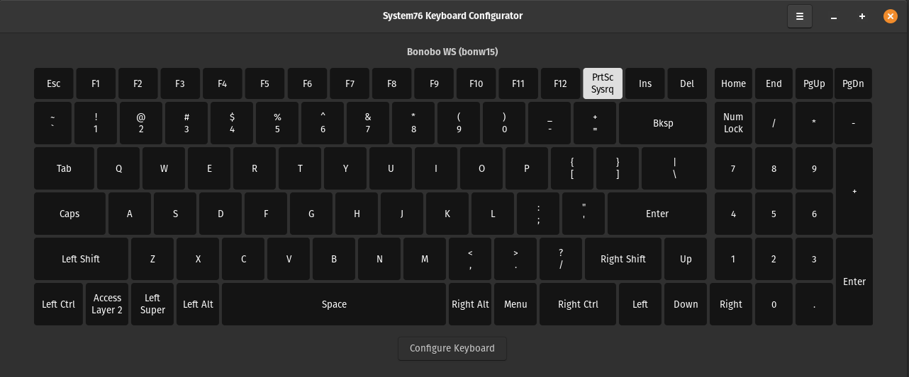
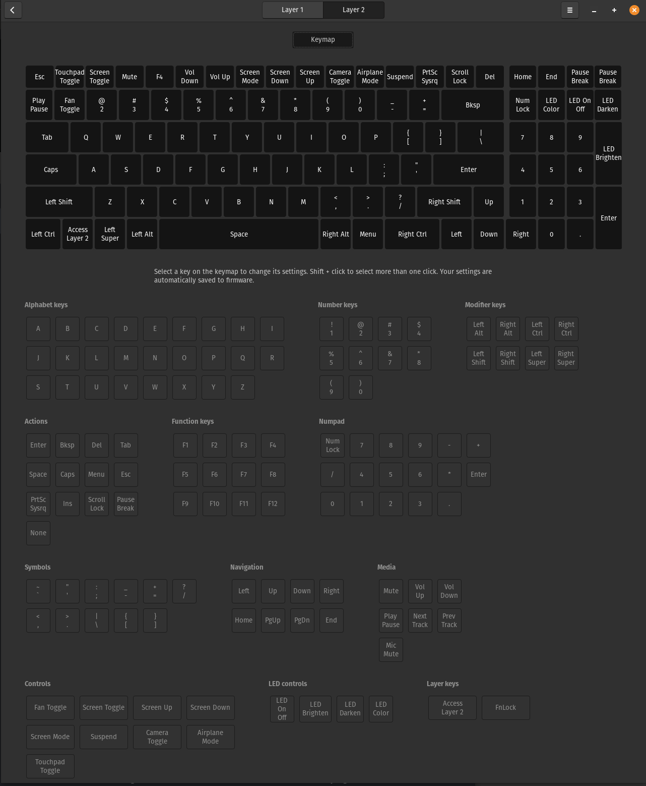
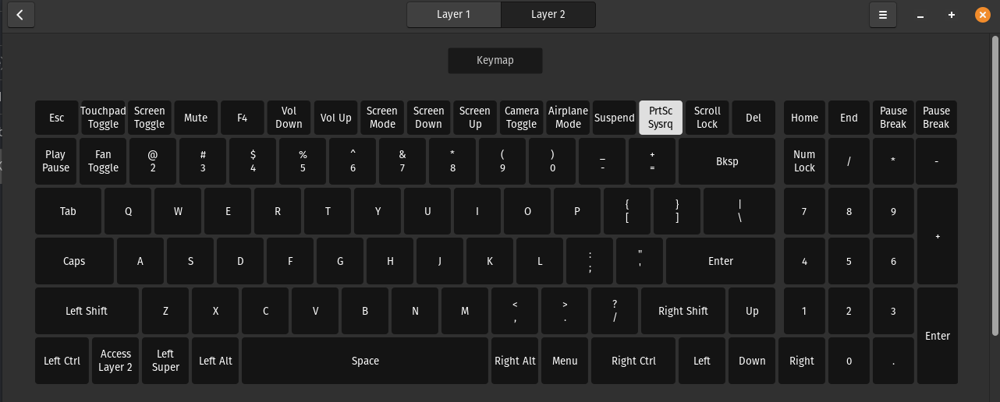
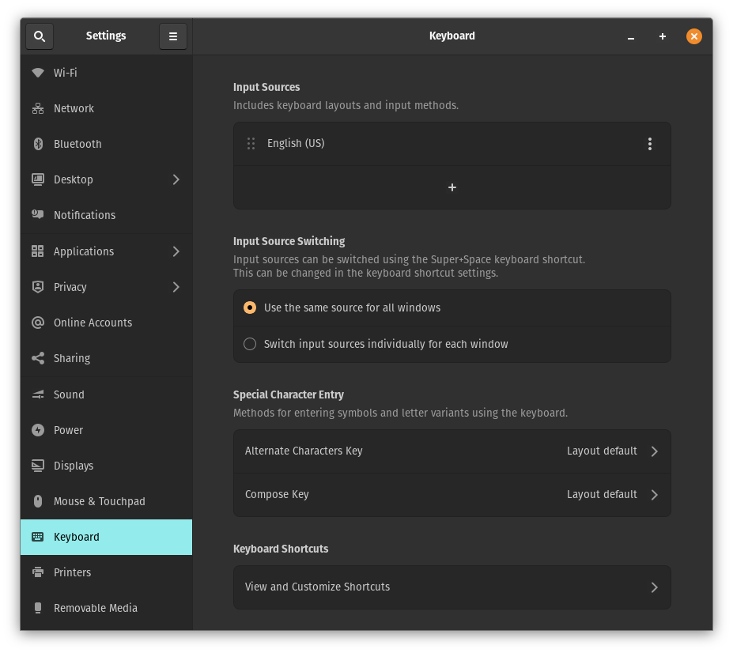
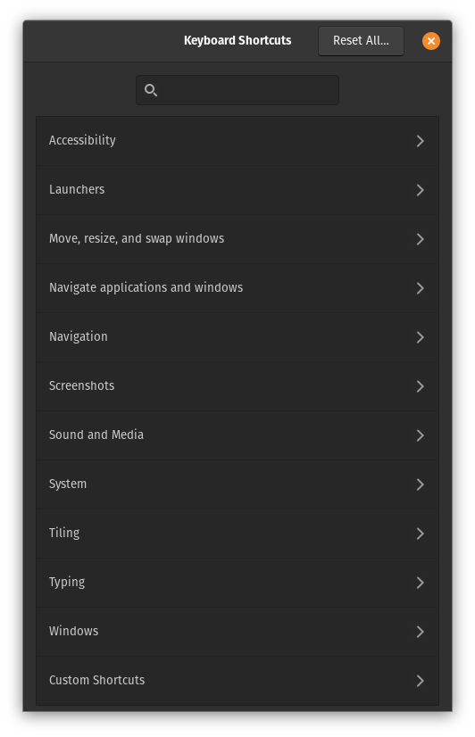
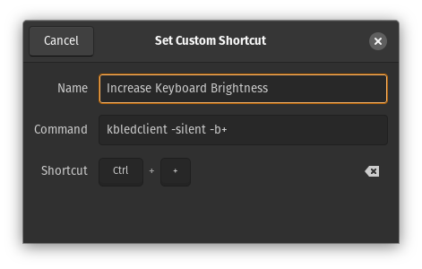

# Individually Addressable Keyboard LED Control Daemon
## Keyboard LED update program for ITE IT-829x based keyboard controllers
I really like my System76 Bonobo WS (bonw15) laptop but have always found it extremely annoying when I accidentally hit the `Caps Lock` key and wouldn't know until I started typing since there is no visual indication.  The keyboard illumination controls from System76 allow you to turn the backlight on/off, the brightness up/down and cycle the colors through a predefined pallete.  If you dig further into `/sys/class/leds/system76_acpi\:\:kbd_backlight/` you can change the RGB color and brightness but there is still no mechanism to control individual LEDS.  

Since this still didn't solve my problem, so I set out to find a way to bypass the System76 driver and write my own.  I stumbled across a similar project where [matheusmoreira](https://github.com/matheusmoreira/ite-829x) decoded the signals between Clevo's windows based keyboard control software and the IT829x controller on his Clevo PA70ES (same chipset) to individually change keyboard LED states.  Using this, I was able to prove that it worked on my laptop as well, though its functionality was fairly limited.  I decided to use the decoded commands he found to write a lightweight daemon that could be loaded at boot time to handle the keyboard backlight and change the caps lock, scroll lock and num lock keys in addition to some other features I thought would be neat to have.

The end result is this project that consists of two main programs, `kbled` and `kbledclient` along with a tool I called `semsnoop` that checks the state of semaphores to aid in debugging the two main programs.  

## Compatibility
This software should work with any linux system with a ITE IT-829x USB keyboard controller.  If you are unsure, just look for device ID `048d:8910` with lsusb.  If it shows up on the list, then there is a good chance this software will work.  I have tested this with a System76 Bonobo WS (bonw15) laptop.  It is manufactured by Clevo as an X370SNW.  Here is how the device appears when I run `lsusb`:
```text
Bus 004 Device 001: ID 1d6b:0003 Linux Foundation 3.0 root hub
Bus 003 Device 001: ID 1d6b:0002 Linux Foundation 2.0 root hub
Bus 002 Device 001: ID 1d6b:0003 Linux Foundation 3.0 root hub
Bus 001 Device 005: ID 048d:8910 Integrated Technology Express, Inc. ITE Device(829x) <-- This one!
Bus 001 Device 003: ID 04f2:b7c3 Chicony Electronics Co., Ltd Chicony USB2.0 Camera
Bus 001 Device 006: ID 8087:0033 Intel Corp. 
Bus 001 Device 001: ID 1d6b:0002 Linux Foundation 2.0 root hub
```

### `kbled` daemon:
This program is designed to be launched during system startup by systemd with the included script, though it can be run manually to verify it works before installation.  If you want to run it manually, it must be run as root, so execute it with `sudo kbled` from the command line.  (If you have just compiled the program but haven't installed it, cd to the directory from which it was compiled ex: `cd ~/kbled` followed by `sudo ./kbled`) Optionally it can be called with command line arguments to set the default backlight color and backlight focus color (the color caps lock/num lock/scroll lock keys will be when active) by specifying them sequentially from the command line.  The default if nothing specified on the command line is a blank (0,0,0) backlight and a and a green focus color. 
Syntax: 
```
kbled backlightR backlightG backlightB focusR focusG focusB
```
Example: sets the backlight color to 1/4 brightness green and the focus color to red.
```
sudo kbled 0 63 0 255 0 0
``` 

It sets up a shared memory space that `kbledclient` (called from an unprivileged account) can interact with to modify the keyboard led settings along with a semaphore for accessing the array.  The default scan time is 100 ms (changeable through `kbledclient` or the `kbled` source code) so the max delay between hitting the caps lock key and the color changing should be 100 ms plus whatever delay is present due to the `IT829x` controller.

### `kbledclient` user space client:
This program interacts with the running `kbled` daemon to modify the LED configuration of the keyboard.  The LEDs can be changed all together by changing the backlight and focus colors or on a per-key basis.  Here are the command line parameters:
```text
Usage: kbledclient [parameters...]
 Parameter:                   Description:
 -v                           Verbose output
 -b+                          Increase brightness
 -b-                          Decrease brightness
 -b <0-10>                    Set brightness (default=10)
 -s+                          Increase pattern speed
 -s-                          Decrease pattern speed
 -s <0-2>                     Set pattern speed (default=0)
 -p+                          Increment pattern
 -p-                          Decrement pattern
 -p <-1 to 6>                 Set pattern, (default=-1 [no pattern])
 -bl <Red> <Grn> <Blu>        Set backlight color
 -fo <Red> <Grn> <Blu>        Set focus color (caps/num/scroll locks)
 -c                           Cycle through preset backlight/focus colors
 -k <LED#> <Red> <Grn> <Blu>  Set individual LED (0-114) color
 -kb <LED#>                   Set individual LED (0-114) to backlight color
 -kf <LED#>                   Set individual LED (0-114) to focus color
 -t                           Toggle LEDs on/off
 --speed                      Change update speed (1-65535 ms) default= 100 ms
 --dump                       Show contents of shared memory
 --dump+                      Show contents of shared memory with each key's state
 --help                       Display this message
 Where <Red> <Grn> <Blu> are 0-255
```

### `semsnoop` utility for checking semaphore status:
I'll confess I basically just asked ChatGPT to write me a c program to check the status of the semaphore I used in `kbled` and `kbledclient` to aid in debugging.  Call it without arguments to get the syntax:
```text
Usage: semsnoop <sem_name> <action>
Actions:
  inc - Increment the semaphore
  dec - Decrement the semaphore
  val - Display the current value of the semaphore
```
This will work with any semaphore, so I included it in case anyone else would find it useful.  Here is an example of how I used it during debugging for the named semaphore `/kbled_semaphore`:
```bash
mcurtis@wopr:~$ semsnoop /kbled_semaphore val
Semaphore value: 0
mcurtis@wopr:~$ semsnoop /kbled_semaphore inc
Semaphore incremented successfully.
mcurtis@wopr:~$ semsnoop /kbled_semaphore val
Semaphore value: 1
mcurtis@wopr:~$ semsnoop /kbled_semaphore dec
Semaphore incremented successfully.
mcurtis@wopr:~$ semsnoop /kbled_semaphore val
Semaphore value: 0
```

## Compiling and Installing
1. Install dependencies for `hidapi-libusb` (used to communicate to the USB HID interface), `libsystemd-dev` (used to talk to systemd) and `libevdev` (used to capture caps lock/num lock/scroll lock states).  See the 'More Details' section for further instructions if you want to use `libX11` or `libxkbfile` instead of the default `libevdev` for capturing caps lock/num lock/scroll lock events.  You probably already have gcc, make and git, but if not you will also need to install `build-essential` and `git-all`.
  ```bash
sudo apt update
sudo apt install libhidapi-dev libsystemd-dev libevdev-dev build-essential git-all
```
2. Get the repository from git.  `cd` to wherever you want the code to be in your home directory and run this to pull the archive from github:
```bash
git pull https://github.com/chememjc/kbled.git
```
3. Compile the program and test it to make sure it works.  Press `Ctrl+C` to close the program.  If the keyboard color changed to red and the caps lock button turns purple when you toggle it, then you are ready to install.  If a different key than cap lock turned on or nothing happened when you hit the cap lock key then the keymap may be wrong for your keyboard.  This can be fixed by editing the keymap.h and keymap.c files, more info in the 'More Detail'->'keymaps' section.
```bash
make
./kbled 255 0 0  0 255 255
```
5. Install the app:
```text
sudo make install
sudo systemctl enable kbled
sudo systemctl start kbled
```
You can also check the current status of the `kbled` daemon by running `systemctl status kbled` as a normal user.

Optionally you can install it manually if you would prefer.  Just copy `kbled` and `kbledclient` to `/usr/bin` and copy `kbled.conf` to `/etc/systemd/system/` and execute `sudo systemctl enable kbled` to enable the daemon on system startup and `sudo systemctl start kbled` to start the daemon now.
### Uninstalling
To uninstall, you can run `sudo make uninstall` from the project directory and all of the installed files will be removed.  Alternately you can manually remove it by stopping and disabling the service with `sudo systemctl stop kbled` followed by `sudo systemctl disable kbled`.  You can then remove the installed files with `sudo rm /usr/bin/kbled`, `sudo rm /usr/bin/kbledclient`, `sudo rm /usr/bin/semsnoop` and  `sudo rm /etc/systemd/system/kbled.conf`.

## Hotkeys
The originally mapped hotkeys will cause issues with this software (segfaults sometimes) since they access the USB device.  I still haven't figured out how that side of things works to intercept the signals (see the Background section for more information/research).  To get around this, you can remove the mapping of those keys in the EC controller by using System76's `system76-keyboard-configurator` and map your own hotkeys in your desktop environment.  I will provide the steps I used here for PopOS! 22.04 LTS.

### Removing default LED key mappings
Start by installing `system76-keyboard-configurator`.  Do this by installing it through apt:
```text
sudo apt update
sudo apt install system76-keyboard-configurator
```

Run it from the command line by typing `system76-keyboard-configurator`, it will ask for your password to run it as root since you will be modifying the settings on the embedded controller (EC).  Click on the button on the 'Configure Keyboard' button in the bottom center.  (note: the print screen button is highlighted since I pressed that key for the screen capture)



Next, click on the 'Layer 2' button on the top middle right to get to where the LED keys are mapped:



For each of the 'LED Color' 'LED On Off' 'LED Darken' 'LED Brightness' keys, click on the key (it will be outlined when you click) and remap it back to the respective keys from the 'Numpad' section by clicking on them.  They should look like this afterwards:



### Adding new LED hotkey mappings
This might be a bit different in other distributions than PopOS! 22.04 LTS, but you should be able to do something through a similar set of steps.  Go into settings and select keyboard from the list on the left.  Then click on 'View and Customize Shortcuts' on the bottom of the right frame:



From there a 'Keyboard Shortcuts' window will open, scroll to the bottom and select 'Custom Shortcuts':



Click on the plus button on the bottom, this will open another window, 'Add Custom Shortcut', where you can assign it a name, command and shortcut sequence:



Here is how I have it setup on my computer.  When clicking on the 'Set Shortcut' you can't seem to include the function key as a modifier so I had to compromise and use the control key.  See the 'More Detail' section for an explanation of why this is the case and how I might end up trying to get it to work with the function key in the future.  In case you're worried (I was) the - key and + key on the main keyboard are different than the ones on the numpad so it won't conflict with zooming in and out in a web browser with `Ctrl =` and `Ctrl -`.

*Note: if you are running `kbledclient` from your home directory rather than /usr/bin, you need to specify a fully path and not a relative path.  Ex: use `/home/mcurtis/kbled/kbledclient --silent -b-` instead of `~/kbled/kbledclient --silent -b-`*

|      Function       |          Command          | Shortcut |
| ------------------- | ------------------------- | -------- |
| Color Cycle         | kbledclient -silent -c    | Ctrl /   |
| Backlight On/Off    | kbledclient -silent -t    | Ctrl *   |
| Decrease brightness | kbledclient -silent -b-   | Ctrl -   |
| Increase brightness | kbledclient -silent -b+   | Ctrl +   |

# More Detail:
## Background
After doing some digging into System76's [EC firmware](https://github.com/system76/ec/) I was able to determine that the keyboard inputs are handled with the onboard ITE IT5570-128EX microcontroller.  System76 provides schematics to the laptop so I was able to see that  the keyboard inputs are directly connected to this microcontroller.  The keyboard LEDs are handled by another microcontroller that talks to the IT5570 over a SMbus link to an ITT IT8295FN-56ABX chip.  The Digging further into the schematic it is also apparent that the IT8295 has a USB port that is connected the Intel HM770 chipset along with the other internally and externally connected USB devices, explaning why it shows up with `lsusb`.   The IT8295 has a SPI bus that is connected to three MBIA045GFN-A chips that directly connect to the indivudlal LEDs on the keyboard.  
## Compiling from source:
### Required Libraries:
A few libraries are required to compile this software.  Below is a description of each and how to install them.

#### `libhidapi-dev`:
[Library](https://github.com/libusb/hidapi) to talk to USB HID devices.  This is how changes are sent to the IT829X keyboard controller.  Include directive `#include <hidapi/hidapi.h>` in a c file.  Use `-lhidapi-libusb` when calling gcc to link the library.

#### `libx11-dev`:
[Library](https://gitlab.freedesktop.org/xorg/lib/libx11) for interacting with the core X11 sybsystem.  This is needed to check and see if the caps lock, scroll lock and num lock keys are toggled.  Include directive `#include <X11/Xlib.h>` and `#include <X11/XKBlib.h>` in the c file.  Use `-lX11` when calling gcc to link the libraries.  This can be substitued for evdev and libudev with some extra steps.  Define `X11` in the `Makefile` to choose this option.

#### `libxkbfile-dev`:
[Library](https://gitlab.freedesktop.org/xorg/lib/libxkbfile) for interacting with the keyboard events through X11.  This is used to check if the caps lock, scroll lock, and num lock keys are toggled.  Include directive `#include <X11/Xlib.h>` in the c file.  Use `-lxkbfile` when calling gcc to link the library.  This can be subsituted for evdev and libudev with some extra steps.  Define `X11` in the `Makefile` to choose this option.

#### `libevdev-dev`:
Library for interacting with the `/dev/input/eventX` interface to the keyboard.  This is used to check if the caps lock, scroll lock, and num lock keys are toggled.  Include directive `#include <libevdev/libevdev.h>` in the c file.  Use `-levdev` when calling gcc to link the library.  This should be able to work directly from the shell without needing a graphical environment.  Define `EVENT` in the `Makefile` to choose this option.

#### Installing the dependencies:
```bash
sudo apt install libhidapi-dev libx11-dev libxkbfile-dev libevdev-dev
```

# License
I really couldn't care less here... public domain I guess?  If you like it and want to use it, great!  If you want to modify it, great!  If you want to use it in something commercial, great!   An attribution would be nice but even that is optional.  As you would expect from this personal project, I make no guarantees that it works or won't somehow brick your computer, though I highly doubt it and it works great on my computer.  I used the Wireshark captures from [matheusmoreira](https://github.com/matheusmoreira/ite-829x) to make this work, but otherwise it all came from me except the `semsnoop` utility which came from ChatGPT.  
